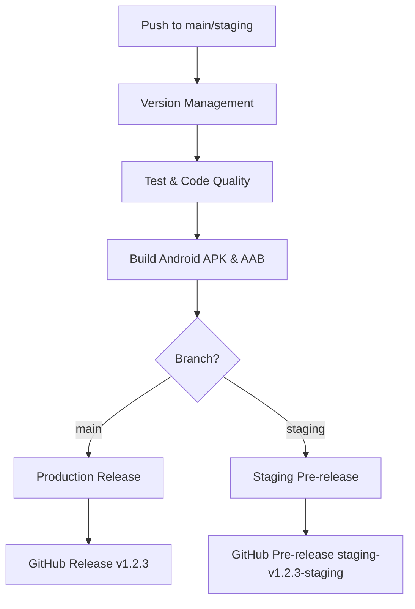

# Flutter CI/CD Test Project

[](https://github.com/d-bhakta/test_ci_cd/actions/workflows/flutter_ci.yml)
[](LICENSE)

A Flutter project with production-ready CI/CD pipeline featuring combined versioning strategy.

## 🚀 Features

- ✅ **Automated CI/CD Pipeline** - GitHub Actions workflow for building and releasing
- ✅ **Combined Versioning Strategy** - Manual control for production, auto-increment for staging
- ✅ **Multi-Branch Support** - Separate workflows for `main` and `staging` branches
- ✅ **Automated Testing** - Unit tests, widget tests, and code coverage
- ✅ **Code Quality Checks** - Formatting verification and static analysis
- ✅ **Automated Releases** - GitHub releases with APK and AAB artifacts

## 📋 Version Strategy

### Production (Main Branch)

```
Format: X.Y.Z+BUILD.HASH
Example: 1.2.3+45.a3f7b2c

✅ Manual version control (X.Y.Z)
✅ Auto-increment build number
✅ Git commit hash for traceability
```

### Staging Branch

```
Format: X.Y.Z-staging+BUILD.HASH
Example: 1.2.3-staging+127.b5e9f1a

✅ Auto-increment build number
✅ Staging suffix identifier
✅ Git commit hash for traceability
```

## 🛠️ Quick Start

### For Production Release

1. **Update version manually** (on main branch):
   ```powershell
   # Windows
   .\bump_version.ps1 patch    # 1.2.3 → 1.2.4 (bug fixes)
   .\bump_version.ps1 minor    # 1.2.3 → 1.3.0 (new features)
   .\bump_version.ps1 major    # 1.2.3 → 2.0.0 (breaking changes)
   ```

   ```bash
   # Linux/Mac
   ./bump_version.sh patch
   ./bump_version.sh minor
   ./bump_version.sh major
   ```

2. **Or update manually** in `pubspec.yaml`:
   ```yaml
   version: 1.3.0+1  # Update X.Y.Z
   ```

3. **Push to trigger pipeline**:
   ```bash
   git add pubspec.yaml
   git commit -m "feat: new feature for v1.3.0"
   git push origin main
   ```

### For Staging Release

Just push to staging - no version update needed!

```bash
git checkout staging
git commit -m "test: testing new feature"
git push origin staging
```

The pipeline auto-increments build numbers and adds `-staging` suffix.

## 📦 Pipeline Workflow



### Pipeline Jobs

1. **Version Management** - Calculates and applies version based on branch
2. **Test & Code Quality** - Runs tests, formatting, and analysis
3. **Build Android** - Builds APK and AAB with proper versioning
4. **Release** - Creates GitHub release with artifacts
5. **Build Summary** - Generates summary in Actions UI

## 📚 Documentation

- **[CI/CD Guide](CI_CD_GUIDE.md)** - Complete guide on using the pipeline
- **[BLOC Testing Guide](BLOC_TESTING_DOC.md)** - BLoC testing documentation

## 🔧 Development

### Prerequisites

- Flutter SDK 3.24.0+
- Dart SDK
- Android Studio / VS Code

### Setup

```bash
# Clone repository
git clone https://github.com/d-bhakta/test_ci_cd.git
cd test_ci_cd

# Install dependencies
flutter pub get

# Run tests
flutter test --coverage

# Run app
flutter run
```

### Testing

```bash
# Run all tests
flutter test

# Run with coverage
flutter test --coverage

# Run specific test
flutter test test/calculator_bloc_test.dart

# Run in watch mode
flutter test --watch
```

### Code Quality

```bash
# Format code
dart format .

# Analyze code
flutter analyze

# Check formatting
dart format --set-exit-if-changed .
```

## 📥 Artifacts & Releases

After each successful build:

### Production Releases (Main Branch)

- **Location**: [GitHub Releases](https://github.com/d-bhakta/test_ci_cd/releases)
- **Tag Format**: `v1.2.3+45.a3f7b2c`
- **Files**: `app-main-{version}.apk`, `app-main-{version}.aab`

### Staging Releases (Staging Branch)

- **Location**: [GitHub Releases](https://github.com/d-bhakta/test_ci_cd/releases) (marked as
  pre-release)
- **Tag Format**: `staging-v1.2.3-staging+127.b5e9f1a`
- **Files**: `app-staging-{version}.apk`, `app-staging-{version}.aab`

## 🎯 Branch Strategy

```
main (production)
  ↑
  └── staging (testing)
        ↑
        └── feature/* (development)
```

### Workflow

1. Develop features in `feature/*` branches
2. Merge to `staging` for testing
3. Validate staging builds
4. Merge to `main` for production release

## 🔍 Monitoring

- **Pipeline Status**: [GitHub Actions](https://github.com/d-bhakta/test_ci_cd/actions)
- **Test Coverage**: Available in Actions artifacts
- **Build Artifacts**: Available in GitHub Releases

## 📊 Project Structure

```
lib/
├── main.dart              # App entry point
├── main_screen.dart       # Main screen
├── screens/               # Feature screens
│   ├── calculator/        # Calculator feature
│   └── user/              # User feature
└── service/               # Services
    ├── base.dart
    └── users_service.dart

test/
├── calculator_bloc_test.dart  # BLoC tests
└── widget_test.dart           # Widget tests

.github/
└── workflows/
    └── flutter_ci.yml     # CI/CD pipeline definition
```

## 🤝 Contributing

1. Fork the repository
2. Create feature branch (`git checkout -b feature/amazing-feature`)
3. Commit changes (`git commit -m 'feat: add amazing feature'`)
4. Push to branch (`git push origin feature/amazing-feature`)
5. Open Pull Request to `staging` branch

## 📝 Commit Convention

Use [Conventional Commits](https://www.conventionalcommits.org/):

```
feat: add new feature
fix: fix bug
docs: update documentation
test: add tests
chore: maintenance tasks
style: formatting changes
refactor: code refactoring
perf: performance improvements
```

## 📄 License

This project is licensed under the MIT License.

## 🙏 Resources

- [Flutter Documentation](https://docs.flutter.dev/)
- [GitHub Actions](https://docs.github.com/en/actions)
- [Semantic Versioning](https://semver.org/)
- [Conventional Commits](https://www.conventionalcommits.org/)
